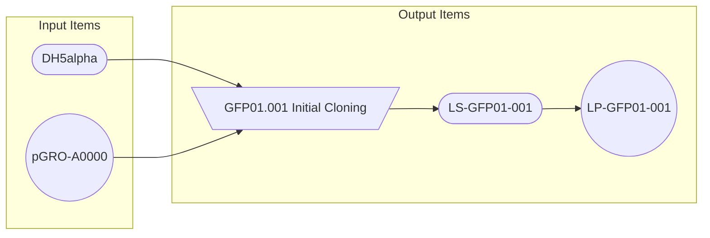
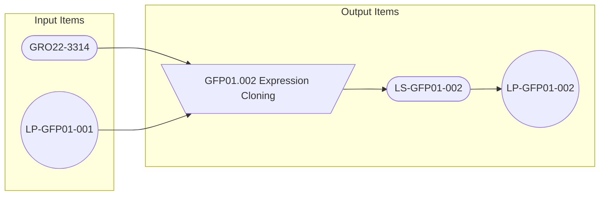
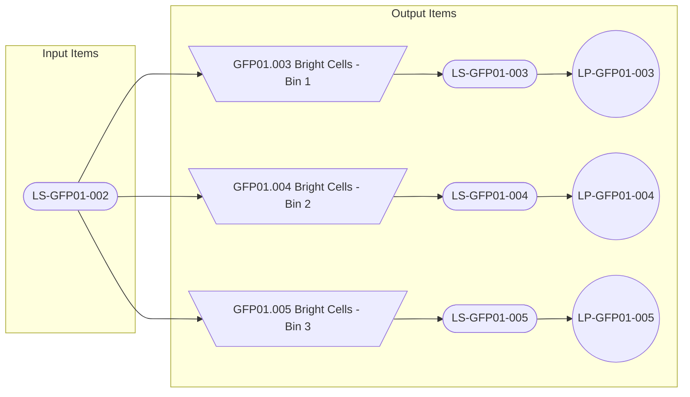
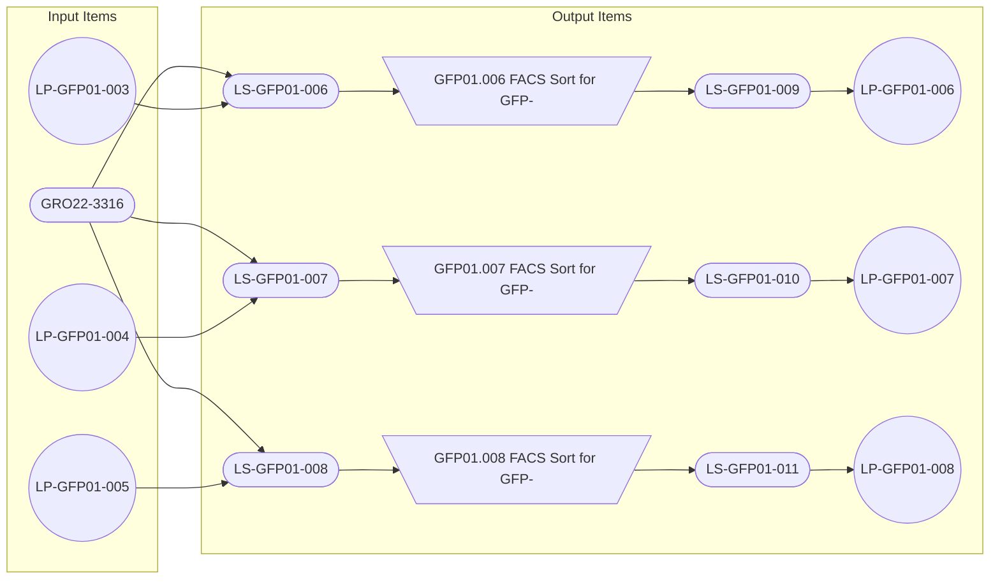
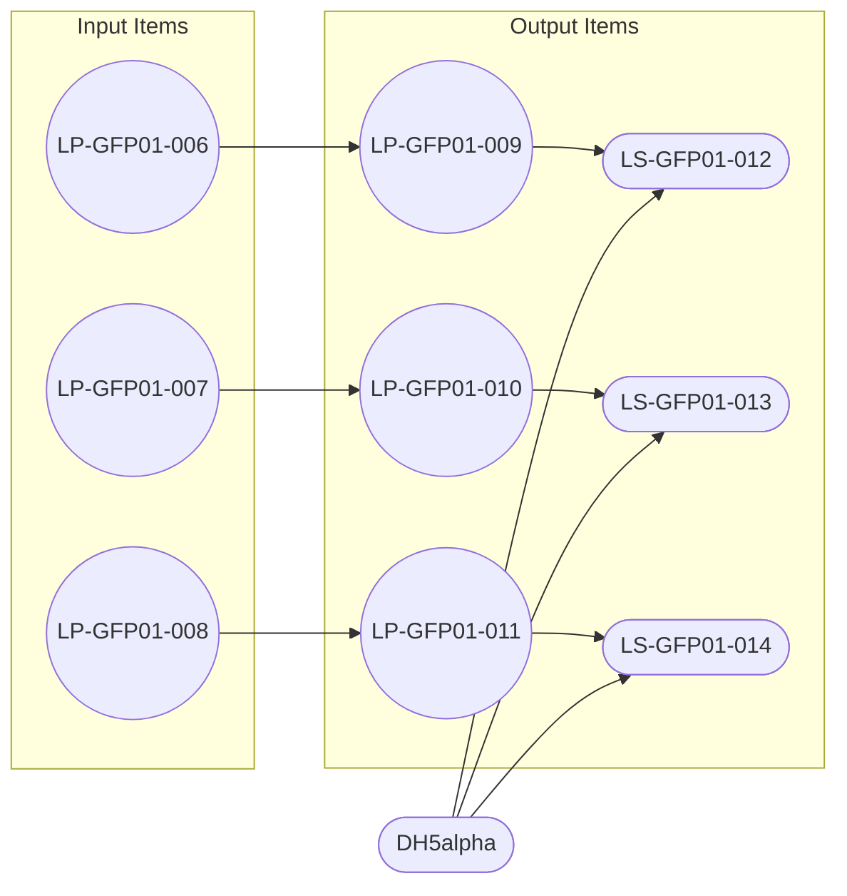
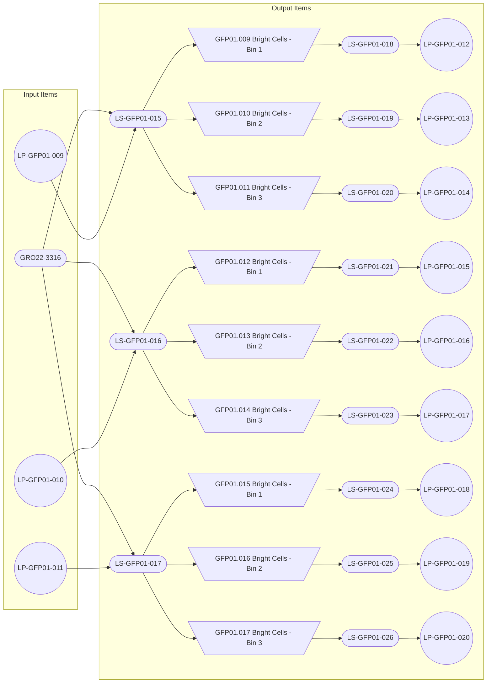

# Example Selection Workflow

## Initial Uploads
Before beginning, we need to add the base library plasmid and the library item itself to LabGuru. This can be done using the usual LG Upload process in Slack.

### Example files {collapsible="true"}

`01. Library Plasmid Upload.xlsx`

| Name       | Plasmid # | Geneious Name | Description                          | Insert    | Affinity Tag | Promoter | Origin       | Resistance Gene | Temperature Sensitive | Cloning ID | Genotype               | Parent Selection | Parent Library | Diversity |
|------------|-----------|---------------|--------------------------------------|-----------|--------------|----------|--------------|-----------------|-----------------------|------------|------------------------|------------------|----------------|-----------|
| pGRO-A0000 | 0         | Test Lib      | The initial library for Crazy Test 1 | sfGFP_lib | N-6His       | P.TetO   | pMB1 (pUC19) | bla             | No                    |            | pUC-(P.TetO:sfGFP_lib) |                  |                | < 10e8    |

 `02. Library Item Upload.xlsx`

| Name                 | Library Key | Description                          | Theoretical Diversity | Diversification Method | Parent Plasmid | Parent Strain |
|----------------------|-------------|--------------------------------------|-----------------------|------------------------|----------------|---------------|
| Test sfGFP Library 1 | GFP01       | Not a real library, just for example | 1.00E+20              | Synthesis              | pGRO-C0000     |               |

## Cloning Cell Transformation (Step 0)

Now we need to record the actual cloning of `pGRO-A0000` into our cloning cell line `DH5alpha`. 

1. Download a selection template from Slack
2. Fill out the selection details:
    * The input plasmid will be the libray plasmid uploaded above (pGRO-A0000)
    * The input strain will be DH5alpha
    * The selection diversity metadata can be added now or changed later
3. Upload the selection via the LG Upload Slack app
4. The back end will create the related items and generate the next IDS from the library keys
    * Plasmid names will have the format `LP-{Library Key}-###`
    * Strain names will have the format `LS-{Library Key}-###`
5. LG Upload will message the user with two new Excel files:
    * A file detailing all of the newly created items.
    * A template file for the stocks of those items. After generating them in lab, the user should submit the stock forms to LG Upload. If the print column is "Y", a cap-and-wrap label will be printed automatically.
6. Actually perform the transformation. Grow and miniprep.

### Data flow {collapsible="true" default-state="expanded"}

### Example files {collapsible="true" id="example-files_0"}
`03. Selection Upload.xlsx`

| Library Key | Step | Selection Name  | Description                                   | Selection Mechanism | Input Plasmid | Input Strain | # Glycerol Stocks | # Plasmid Stocks | Input Diversity | Output Diversity | # Cells In | # Cells Out |
|-------------|------|-----------------|-----------------------------------------------|---------------------|---------------|--------------|-------------------|------------------|-----------------|------------------|------------|-------------|
| GFP01       | 0    | Initial Cloning | Cloning of the library plasmid into DH5 cells | Transformation      | pGRO-C000     | DH5alpha     | 2                 | 2                | 1.00E+20        | < 1e8            |            | 1.00E+08    |

`04. Selection Upload Created Items.xlsx`
<tabs>
<tab title="Selections">

| Library Key | Step | Selection Name            | Description                                   | Selection Mechanism | Parent Plasmid | Parent Strain | Input Diversity | Output Diversity | # Cells In | # Cells Out |
|-------------|------|---------------------------|-----------------------------------------------|---------------------|----------------|---------------|-----------------|------------------|------------|-------------|
| GFP01       | 0    | GFP01.001 Initial Cloning | Cloning of the library plasmid into DH5 cells | Transformation      | pGRO-C000      | DH5alpha      | 1.00E+20        | < 1e8            |            | 1.00E+08    |             
</tab>
<tab title="Plasmids">

| Name         | Description                                        | Insert    | Affinity Tag | Promoter | Origin       | Resistance Gene | Temperature Sensitive | Cloning ID | Genotype                        | Parent Selection          | Parent Library       | Diversity |
|--------------|----------------------------------------------------|-----------|--------------|----------|--------------|-----------------|-----------------------|------------|---------------------------------|---------------------------|----------------------|-----------|
| LP-GFP01-001 | Library Plasmid Resulting from Selection GFP01.001 | sfGFP_lib | N-6His       | P.TetO   | pMB1 (pUC19) | bla             | No                    |            | pUC-(P.TetO:sfGFP_libGFP01.001) | GFP01.001 Initial Cloning | Test sfGFP Library 1 | < 1e8     |

</tab>
<tab title="Strains">

| Name         | Description                                       | Parent Strain | Difference from Parent | Added Plasmids | Removed Plasmids | Genome Additions | Cloning ID | Strain Barcode | Meaning of U | Parent Library       | Parent Selection          | Diversity |
|--------------|---------------------------------------------------|---------------|------------------------|----------------|------------------|------------------|------------|----------------|--------------|----------------------|---------------------------|-----------|
| LS-GFP01-001 | Library Strain Resulting from Selection GFP01.001 | DH5alpha      | Selection GFP01.001    | LP-GFP01-001   |                  |                  |            |                | Canonical    | Test sfGFP Library 1 | GFP01.001 Initial Cloning | < 1e8     |

</tab>
</tabs>

`05. Output stock upload form`

| Inventory Type | Name           | Stock Type | Box | Position | Concentration | Buffer | Quant Method | 2D Barcode | Print? |
|----------------|----------------|------------|-----|----------|---------------|--------|--------------|------------|--------|
| Plasmid        | LP-GFP01-001-A | Tube       |     |          |               |        |              |            | Y      |
| Plasmid        | LP-GFP01-001-B | Tube       |     |          |               |        |              |            | Y      |
| Strain         | LS-GFP01-001-A | Tube       |     |          |               |        |              |            | Y      |
| Strain         | LS-GFP01-001-B | Tube       |     |          |               |        |              |            | Y      |

## Expression Cell Transformation (Step 1)

Next we need to transform the miniprepped library plasmid into expression cells. 

We can record an expression cell transformation in one of two ways. In this example, we will record the transformation
as its own selection step. The process is identical to the prior step above, except that the input plasmid will be the
result of Step 0 (LP-GFP01-001) and the input strain will be GRO22-3314 (the pAzF expression strain)

### Data flow {collapsible="true" default-state="expanded" id="data-flow_1"}

### Example files {collapsible="true" id="example-files_1"}
`06. Selection Upload.xlsx`

| Library Key | Step | Selection Name     | Description                                               | Selection Mechanism | Input Plasmid | Input Strain | # Glycerol Stocks | # Plasmid Stocks | Input Diversity | Output Diversity | # Cells In | # Cells Out |
|-------------|------|--------------------|-----------------------------------------------------------|---------------------|---------------|--------------|-------------------|------------------|-----------------|------------------|------------|-------------|
| GFP01       | 1    | Expression Cloning | Cloning of the library plasmid into pAzF epxression cells | Transformation      | LP-GFP01-001  | GRO22-3314   | 1                 | 1                | 1.00E+08        | < 1e8            |            | 1.00E+08    |

`07. Selection Upload Created Items.xlsx`
<tabs>
<tab title="Selections">

| Library Key | Step | Selection Name               | Description                                               | Selection Mechanism | Parent Plasmid | Parent Strain | Input Diversity | Output Diversity | # Cells In | # Cells Out |
|-------------|------|------------------------------|-----------------------------------------------------------|---------------------|----------------|---------------|-----------------|------------------|------------|-------------|
| GFP01       | 1    | GFP01.002 Expression Cloning | Cloning of the library plasmid into pAzF expression cells | Transformation      | LP-GFP01-001   | GRO22-3314    | 1.00E+08        | < 1e8            |            | 1.00E+08    |

</tab>
<tab title="Plasmids">

| Name         | Description                                        | Insert    | Affinity Tag | Promoter | Origin       | Resistance Gene | Temperature Sensitive | Cloning ID | Genotype                        | Parent Selection             | Parent Library       | Diversity |
|--------------|----------------------------------------------------|-----------|--------------|----------|--------------|-----------------|-----------------------|------------|---------------------------------|------------------------------|----------------------|-----------|
| LP-GFP01-002 | Library Plasmid Resulting from Selection GFP01.001 | sfGFP_lib | N-6His       | P.TetO   | pMB1 (pUC19) | bla             | No                    |            | pUC-(P.TetO:sfGFP_libGFP01.002) | GFP01.002 Expression Cloning | Test sfGFP Library 1 | < 1e8     |

</tab>
<tab title="Strains">

| Name         | Description                                       | Parent Strain | Difference from Parent | Added Plasmids | Removed Plasmids | Genome Additions | Cloning ID | Strain Barcode | Meaning of U | Parent Library       | Parent Selection             | Diversity |
|--------------|---------------------------------------------------|---------------|------------------------|----------------|------------------|------------------|------------|----------------|--------------|----------------------|------------------------------|-----------|
| LS-GFP01-002 | Library Strain Resulting from Selection GFP01.002 | GRO22-3314    | LP-GFP01-002           | LP-GFP01-002   |                  |                  |            |                | pAzF         | Test sfGFP Library 1 | GFP01.002 Expression Cloning | < 1e8     |

</tab>
</tabs>

`08. Output stock upload form`

| Inventory Type | Name           | Stock Type | Box | Position | Concentration | Buffer | Quant Method | 2D Barcode | Print? |
|----------------|----------------|------------|-----|----------|---------------|--------|--------------|------------|--------|
| Plasmid        | LP-GFP01-002-A | Tube       |     |          |               |        |              |            | Y      |
| Strain         | LS-GFP01-002-A | Tube       |     |          |               |        |              |            | Y      |

## Bright Cell Selection (Step 2)

Now we will express our library and sort for GFP+ cells. We will collect 10,000 cells from each of 3 bins.

The process is the same as the prior steps, except that the "Input Plasmid" value will be left blank and the "Input Strain" value will be the output of the previous step, LS-GFP01-002

### Data flow {collapsible="true" default-state="expanded" id="data-flow_2"}

### Example files {collapsible="true" id="example-files_2"}
`09. Selection Upload.xlsx`

| Library Key | Step | Selection Name       | Description               | Selection Mechanism | Input Plasmid | Input Strain | # Glycerol Stocks | # Plasmid Stocks | Input Diversity | Output Diversity | # Cells In | # Cells Out |
|-------------|------|----------------------|---------------------------|---------------------|---------------|--------------|-------------------|------------------|-----------------|------------------|------------|-------------|
| GFP01       | 2    | Bright Cells - Bin 1 | FACS Sort for GFP+, Bin 1 | FACS                |               | LS-GFP01-002 | 1                 | 1                | 1.00E+08        | <10,000          | 100,000    | 1.00E+04    |
| GFP01       | 2    | Bright Cells - Bin 2 | FACS Sort for GFP+, Bin 2 | FACS                |               | LS-GFP01-002 | 1                 | 1                | 1.00E+08        | <10,000          | 100,000    | 1.00E+04    |
| GFP01       | 2    | Bright Cells - Bin 3 | FACS Sort for GFP+, Bin 3 | FACS                |               | LS-GFP01-002 | 1                 | 1                | 1.00E+08        | <10,000          | 100,000    | 1.00E+04    |

`10. Selection Upload Created Items.xlsx`
<tabs>
<tab title="Selections">

| Library Key | Step | Selection Name                 | Description               | Selection Mechanism | Parent Plasmid | Parent Strain | Input Diversity | Output Diversity | # Cells In | # Cells Out |
|-------------|------|--------------------------------|---------------------------|---------------------|----------------|---------------|-----------------|------------------|------------|-------------|
| GFP01       | 2    | GFP01.003 Bright Cells - Bin 1 | FACS Sort for GFP+, Bin 1 | FACS                |                | LS-GFP01-002  | 1.00E+08        | <10,000          | 100000     | 1.00E+04    |
| GFP01       | 2    | GFP01.004 Bright Cells - Bin 2 | FACS Sort for GFP+, Bin 2 | FACS                |                | LS-GFP01-002  | 1.00E+08        | <10,000          | 100000     | 1.00E+04    |
| GFP01       | 2    | GFP01.005 Bright Cells - Bin 3 | FACS Sort for GFP+, Bin 3 | FACS                |                | LS-GFP01-002  | 1.00E+08        | <10,000          | 100000     | 1.00E+04    |

</tab>
<tab title="Plasmids">

| Name         | Description                                        | Insert    | Affinity Tag | Promoter | Origin       | Resistance Gene | Temperature Sensitive | Cloning ID | Genotype                        | Parent Selection               | Parent Library       | Diversity |
|--------------|----------------------------------------------------|-----------|--------------|----------|--------------|-----------------|-----------------------|------------|---------------------------------|--------------------------------|----------------------|-----------|
| LP-GFP01-003 | Library Plasmid Resulting from Selection GFP01.003 | sfGFP_lib | N-6His       | P.TetO   | pMB1 (pUC19) | bla             | No                    |            | pUC-(P.TetO:sfGFP_libGFP01.003) | GFP01.003 Bright Cells - Bin 1 | Test sfGFP Library 1 | 1.00E+04  |
| LP-GFP01-004 | Library Plasmid Resulting from Selection GFP01.004 | sfGFP_lib | N-6His       | P.TetO   | pMB1 (pUC19) | bla             | No                    |            | pUC-(P.TetO:sfGFP_libGFP01.004) | GFP01.004 Bright Cells - Bin 2 | Test sfGFP Library 1 | 1.00E+04  |
| LP-GFP01-005 | Library Plasmid Resulting from Selection GFP01.005 | sfGFP_lib | N-6His       | P.TetO   | pMB1 (pUC19) | bla             | No                    |            | pUC-(P.TetO:sfGFP_libGFP01.005) | GFP01.005 Bright Cells - Bin 3 | Test sfGFP Library 1 | 1.00E+04  |

</tab>
<tab title="Strains">

| Name         | Description                                       | Parent Strain | Difference from Parent | Added Plasmids | Removed Plasmids | Genome Additions | Cloning ID | Strain Barcode | Meaning of U | Parent Library       | Parent Selection               | Diversity |
|--------------|---------------------------------------------------|---------------|------------------------|----------------|------------------|------------------|------------|----------------|--------------|----------------------|--------------------------------|-----------|
| LS-GFP01-003 | Library Strain Resulting from Selection GFP01.003 | LS-GFP01-002  | FACS Selection         | LP-GFP01-003   | LP-GFP01-002     |                  |            |                | pAzF         | Test sfGFP Library 1 | GFP01.003 Bright Cells - Bin 1 | 1.00E+04  |
| LS-GFP01-004 | Library Strain Resulting from Selection GFP01.004 | LS-GFP01-002  | FACS Selection         | LP-GFP01-004   | LP-GFP01-002     |                  |            |                | pAzF         | Test sfGFP Library 1 | GFP01.004 Bright Cells - Bin 2 | 1.00E+04  |
| LS-GFP01-005 | Library Strain Resulting from Selection GFP01.005 | LS-GFP01-002  | FACS Selection         | LP-GFP01-005   | LP-GFP01-002     |                  |            |                | pAzF         | Test sfGFP Library 1 | GFP01.005 Bright Cells - Bin 3 | 1.00E+04  |

</tab>
</tabs>

`11. Output stock upload form`

|   Type   |       Name      | Form | Empty Col | Value |
|----------|-----------------|------|-----------|-------|
| Plasmid  | LP-GFP01-003-A  | Tube |           |   Y   |
| Strain   | LS-GFP01-003-A  | Tube |           |   Y   |
| Plasmid  | LP-GFP01-004-A  | Tube |           |   Y   |
| Strain   | LS-GFP01-004-A  | Tube |           |   Y   |
| Plasmid  | LP-GFP01-005-A  | Tube |           |   Y   |
| Strain   | LS-GFP01-005-A  | Tube |           |   Y   |

## Dark Cell Selection (Step 3)

Next we will remove the dark population. For some inexplicable reason, we want to test these in the pAcF cell line GRO22-3316. 
This time, we will combine the expression transformation and selection into a single step. To do this, we will set the "Input Plasmid" values to the output plasmids from Step 2
and the "Input Strain" values to GRO22-3316.

### Data flow {collapsible="true" default-state="expanded" id="data-flow_3"}

### Example files {collapsible="true" id="example-files_3"}
`12. Selection Upload.xlsx`

| Library Key | Step | Selection Name | Description        | Selection Mechanism | Input Plasmid | Input Strain | # Glycerol Stocks | # Plasmid Stocks | Input Diversity | Output Diversity | # Cells In | # Cells Out |
|-------------|------|----------------|--------------------|---------------------|---------------|--------------|-------------------|------------------|-----------------|------------------|------------|-------------|
| GFP01       | 3    | Dark Cells     | FACS Sort for GFP- | FACS                | LP-GFP01-003  | GRO22-3316   | 1                 | 1                | <10,000         | <10,000          | 100,000    | 1.00E+04    |
| GFP01       | 3    | Dark Cells     | FACS Sort for GFP- | FACS                | LP-GFP01-004  | GRO22-3316   | 1                 | 1                | <10,000         | <10,000          | 100,000    | 1.00E+04    |
| GFP01       | 3    | Dark Cells     | FACS Sort for GFP- | FACS                | LP-GFP01-005  | GRO22-3316   | 1                 | 1                | <10,000         | <10,000          | 100,000    | 1.00E+04    |

`13. Selection Upload Created Items.xlsx`
<tabs>
<tab title="Selections">

| Library Key | Step | Selection Name               | Description        | Selection Mechanism | Parent Plasmid | Parent Strain | Input Diversity | Output Diversity | # Cells In | # Cells Out |
|-------------|------|------------------------------|--------------------|---------------------|----------------|---------------|-----------------|------------------|------------|-------------|
| GFP01       | 3    | GFP01.006 FACS Sort for GFP- | FACS Sort for GFP- | FACS                | LP-GFP01-003   | GRO22-3316    | <10,000         | <10,000          | 100000     | 10000       |
| GFP01       | 3    | GFP01.007 FACS Sort for GFP- | FACS Sort for GFP- | FACS                | LP-GFP01-004   | GRO22-3316    | <10,000         | <10,000          | 100000     | 10000       |
| GFP01       | 3    | GFP01.008 FACS Sort for GFP- | FACS Sort for GFP- | FACS                | LP-GFP01-005   | GRO22-3316    | <10,000         | <10,000          | 100000     | 10000       |

</tab>
<tab title="Plasmids">

| Name         | Description                                        | Insert    | Affinity Tag | Promoter | Origin       | Resistance Gene | Temperature Sensitive | Cloning ID | Genotype                        | Parent Selection             | Parent Library       | Diversity |
|--------------|----------------------------------------------------|-----------|--------------|----------|--------------|-----------------|-----------------------|------------|---------------------------------|------------------------------|----------------------|-----------|
| LP-GFP01-006 | Library Plasmid Resulting from Selection GFP01.006 | sfGFP_lib | N-6His       | P.TetO   | pMB1 (pUC19) | bla             | No                    |            | pUC-(P.TetO:sfGFP_libGFP01.006) | GFP01.006 FACS Sort for GFP- | Test sfGFP Library 1 | 1.00E+04  |
| LP-GFP01-007 | Library Plasmid Resulting from Selection GFP01.007 | sfGFP_lib | N-6His       | P.TetO   | pMB1 (pUC19) | bla             | No                    |            | pUC-(P.TetO:sfGFP_libGFP01.007) | GFP01.007 FACS Sort for GFP- | Test sfGFP Library 1 | 1.00E+04  |
| LP-GFP01-008 | Library Plasmid Resulting from Selection GFP01.008 | sfGFP_lib | N-6His       | P.TetO   | pMB1 (pUC19) | bla             | No                    |            | pUC-(P.TetO:sfGFP_libGFP01.008) | GFP01.008 FACS Sort for GFP- | Test sfGFP Library 1 | 1.00E+04  |

</tab>
<tab title="Strains">

| Name         | Description                                       | Parent Strain | Difference from Parent             | Added Plasmids | Removed Plasmids | Genome Additions | Cloning ID | Strain Barcode | Meaning of U | Parent Library       | Parent Selection               | Diversity |
|--------------|---------------------------------------------------|---------------|------------------------------------|----------------|------------------|------------------|------------|----------------|--------------|----------------------|--------------------------------|-----------|
| LS-GFP01-006 | Library Strain Created for Selection GFP01.006    | GRO22-3316    | Added library plasmid LP-GFP01-006 | LP-GFP01-003   |                  |                  |            |                | pAcF         | Test sfGFP Library 1 | GFP01.003 Bright Cells - Bin 1 | 1.00E+04  |
| LS-GFP01-007 | Library Strain Created for Selection GFP01.007    | GRO22-3316    | Added library plasmid LP-GFP01-007 | LP-GFP01-004   |                  |                  |            |                | pAcF         | Test sfGFP Library 1 | GFP01.004 Bright Cells - Bin 2 | 1.00E+04  |
| LS-GFP01-008 | Library Strain Created for Selection GFP01.008    | GRO22-3316    | Added library plasmid LP-GFP01-008 | LP-GFP01-005   |                  |                  |            |                | pAcF         | Test sfGFP Library 1 | GFP01.005 Bright Cells - Bin 3 | 1.00E+04  |
| LS-GFP01-009 | Library Strain Resulting from Selection GFP01.006 | LS-GFP01-003  | FACS Selection                     | LP-GFP01-006   | LP-GFP01-003     |                  |            |                | pAcF         | Test sfGFP Library 1 | GFP01.006 FACS Sort for GFP-   | 1.00E+04  |
| LS-GFP01-010 | Library Strain Resulting from Selection GFP01.007 | LS-GFP01-004  | FACS Selection                     | LP-GFP01-007   | LP-GFP01-004     |                  |            |                | pAcF         | Test sfGFP Library 1 | GFP01.007 FACS Sort for GFP-   | 1.00E+04  |
| LS-GFP01-011 | Library Strain Resulting from Selection GFP01.008 | LS-GFP01-005  | FACS Selection                     | LP-GFP01-008   | LP-GFP01-005     |                  |            |                | pAcF         | Test sfGFP Library 1 | GFP01.008 FACS Sort for GFP-   | 1.00E+04  |

</tab>
</tabs>

`14. Output stock upload form`

| Inventory Type | Name           | Stock Type | Box | Position | Concentration | Buffer | Quant Method | 2D Barcode | Print? |
|----------------|----------------|------------|-----|----------|---------------|--------|--------------|------------|--------|
| Plasmid        | LP-GFP01-006-A | Tube       |     |          |               |        |              |            | Y      |
| Plasmid        | LP-GFP01-007-A | Tube       |     |          |               |        |              |            | Y      |
| Plasmid        | LP-GFP01-008-A | Tube       |     |          |               |        |              |            | Y      |
| Strain         | LS-GFP01-006-A | Tube       |     |          |               |        |              |            | Y      |
| Strain         | LS-GFP01-007-A | Tube       |     |          |               |        |              |            | Y      |
| Strain         | LS-GFP01-008-A | Tube       |     |          |               |        |              |            | Y      |
| Strain         | LS-GFP01-009-A | Tube       |     |          |               |        |              |            | Y      |
| Strain         | LS-GFP01-010-A | Tube       |     |          |               |        |              |            | Y      |
| Strain         | LS-GFP01-011-A | Tube       |     |          |               |        |              |            | Y      |

## Subcloning into pET plasimds

Continuing with our theme of inexplicable next steps, we want to do our next round of selections in a pET backbone instead
of the pUC we have used up to this point. For this, we will submit normal Plasmid and Strain uploads to the Slack app. You will neeed
to determine the next plasmid and strain IDs on your own.

### Data Flow {collapsible="true" default-state="expanded" id="data-flow_subcloning"}

### Example files {collapsible="true" id="example-files_subcloning"}
`15. New Plasmid Upload.xlsx`

| Name         | Plasmid # | Geneious Name | Description                                | Insert             | Affinity Tag | Promoter | Origin        | Resistance Gene | Temperature Sensitive | Cloning ID | Genotype                                     | Parent Selection             | Parent Library       |
|--------------|-----------|---------------|--------------------------------------------|--------------------|--------------|----------|---------------|-----------------|-----------------------|------------|----------------------------------------------|------------------------------|----------------------|
| LP-GFP01-009 |           |               | LP-GFP01-006 subcloned into a pET backbone | sfGFP_libGFP01.006 | N-6His       | P.TetO   | pMB1 (pBR322) | bla             | No                    |            | pET-(P.LacIq:tetR-P.TetO:sfGFP_libGFP01.006) | GFP01.006 FACS Sort for GFP- | Test sfGFP Library 1 |        
| LP-GFP01-010 |           |               | LP-GFP01-007 subcloned into a pET backbone | sfGFP_libGFP01.007 | N-6His       | P.TetO   | pMB1 (pBR322) | bla             | No                    |            | pET-(P.LacIq:tetR-P.TetO:sfGFP_libGFP01.007) | GFP01.007 FACS Sort for GFP- | Test sfGFP Library 1 |         
| LP-GFP01-011 |           |               | LP-GFP01-008 subcloned into a pET backbone | sfGFP_libGFP01.008 | N-6His       | P.TetO   | pMB1 (pBR322) | bla             | No                    |            | pET-(P.LacIq:tetR-P.TetO:sfGFP_libGFP01.008) | GFP01.008 FACS Sort for GFP- | Test sfGFP Library 1 |       

`16. New Strain Upload.xlsx`

| Name         | Description                    | Parent Strain | Difference from Parent | Added Plasmids | Removed Plasmids | Genome Additions | Cloning ID | Strain Barcode | Meaning of U | Parent Library       | Parent Selection             |
|--------------|--------------------------------|---------------|------------------------|----------------|------------------|------------------|------------|----------------|--------------|----------------------|------------------------------|
| LS-GFP01-012 | Cloing strain for LP-GFP01-009 | LP-GFP01-009  | LP-GFP01-009           |                |                  |                  |            |                | Cognate      | Test sfGFP Library 1 | GFP01.006 FACS Sort for GFP- |
| LS-GFP01-013 | Cloing strain for LP-GFP01-010 | LP-GFP01-010  | LP-GFP01-010           |                |                  |                  |            |                | Cognate      | Test sfGFP Library 1 | GFP01.007 FACS Sort for GFP- |
| LS-GFP01-014 | Cloing strain for LP-GFP01-011 | LP-GFP01-011  | LP-GFP01-011           |                |                  |                  |            |                | Cognate      | Test sfGFP Library 1 | GFP01.008 FACS Sort for GFP- |

## Bright Cell Selection in pET (Step 4)
Our final example selection will be a GFP+ sort in the newly cloned pET plasmids. For this round, we will again collect 
10,000 cells into each of 3 bins. The selection upload file will use the new pET plasmids as the "Input Plasmid" and
GRO22-3314 for the "Input Strain". This means that the cloning transformation and selections will be done in the same step again.

### Data flow {collapsible="true" default-state="expanded" id="data-flow_4"}

### Example files {collapsible="true" id="example-files_4"}
`17. Selection Upload.xlsx`

| Library Key | Step | Selection Name       | Description               | Selection Mechanism | Input Plasmid | Input Strain | # Glycerol Stocks | # Plasmid Stocks | Input Diversity | Output Diversity | # Cells In | # Cells Out |
|-------------|------|----------------------|---------------------------|---------------------|---------------|--------------|-------------------|------------------|-----------------|------------------|------------|-------------|
| GFP01       | 4    | Bright Cells - Bin 1 | FACS Sort for GFP+, Bin 1 | FACS                | LP-GFP01-009  | GRO22-3314   | 1                 | 1                | 1.00E+08        | <10,000          | 100,000    | 1.00E+04    |
| GFP01       | 4    | Bright Cells - Bin 2 | FACS Sort for GFP+, Bin 2 | FACS                | LP-GFP01-009  | GRO22-3314   | 1                 | 1                | 1.00E+08        | <10,000          | 100,000    | 1.00E+04    |
| GFP01       | 4    | Bright Cells - Bin 3 | FACS Sort for GFP+, Bin 3 | FACS                | LP-GFP01-009  | GRO22-3314   | 1                 | 1                | 1.00E+08        | <10,000          | 100,000    | 1.00E+04    |
| GFP01       | 4    | Bright Cells - Bin 1 | FACS Sort for GFP+, Bin 1 | FACS                | LP-GFP01-010  | GRO22-3314   | 1                 | 1                | 1.00E+08        | <10,000          | 100,000    | 1.00E+04    |
| GFP01       | 4    | Bright Cells - Bin 2 | FACS Sort for GFP+, Bin 2 | FACS                | LP-GFP01-010  | GRO22-3314   | 1                 | 1                | 1.00E+08        | <10,000          | 100,000    | 1.00E+04    |
| GFP01       | 4    | Bright Cells - Bin 3 | FACS Sort for GFP+, Bin 3 | FACS                | LP-GFP01-010  | GRO22-3314   | 1                 | 1                | 1.00E+08        | <10,000          | 100,000    | 1.00E+04    |
| GFP01       | 4    | Bright Cells - Bin 1 | FACS Sort for GFP+, Bin 1 | FACS                | LP-GFP01-011  | GRO22-3314   | 1                 | 1                | 1.00E+08        | <10,000          | 100,000    | 1.00E+04    |
| GFP01       | 4    | Bright Cells - Bin 2 | FACS Sort for GFP+, Bin 2 | FACS                | LP-GFP01-011  | GRO22-3314   | 1                 | 1                | 1.00E+08        | <10,000          | 100,000    | 1.00E+04    |
| GFP01       | 4    | Bright Cells - Bin 3 | FACS Sort for GFP+, Bin 3 | FACS                | LP-GFP01-011  | GRO22-3314   | 1                 | 1                | 1.00E+08        | <10,000          | 100,000    | 1.00E+04    |

`18. Selection Upload Created Items.xlsx`
<tabs>
<tab title="Selections">

| Library Key | Step | Selection Name                 | Description               | Selection Mechanism | Parent Plasmid | Parent Strain | Input Diversity | Output Diversity | # Cells In | # Cells Out |
|-------------|------|--------------------------------|---------------------------|---------------------|----------------|---------------|-----------------|------------------|------------|-------------|
| GFP01       | 4    | GFP01.009 Bright Cells - Bin 1 | FACS Sort for GFP+, Bin 1 | FACS                | LP-GFP01-009   | GRO22-3314    | 1.00E+08        | <10,000          | 100,000    | 1.00E+04    |
| GFP01       | 4    | GFP01.010 Bright Cells - Bin 2 | FACS Sort for GFP+, Bin 2 | FACS                | LP-GFP01-009   | GRO22-3314    | 1.00E+08        | <10,000          | 100,000    | 1.00E+04    |
| GFP01       | 4    | GFP01.011 Bright Cells - Bin 3 | FACS Sort for GFP+, Bin 3 | FACS                | LP-GFP01-009   | GRO22-3314    | 1.00E+08        | <10,000          | 100,000    | 1.00E+04    |
| GFP01       | 4    | GFP01.012 Bright Cells - Bin 1 | FACS Sort for GFP+, Bin 1 | FACS                | LP-GFP01-010   | GRO22-3314    | 1.00E+08        | <10,000          | 100,000    | 1.00E+04    |
| GFP01       | 4    | GFP01.013 Bright Cells - Bin 2 | FACS Sort for GFP+, Bin 2 | FACS                | LP-GFP01-010   | GRO22-3314    | 1.00E+08        | <10,000          | 100,000    | 1.00E+04    |
| GFP01       | 4    | GFP01.014 Bright Cells - Bin 3 | FACS Sort for GFP+, Bin 3 | FACS                | LP-GFP01-010   | GRO22-3314    | 1.00E+08        | <10,000          | 100,000    | 1.00E+04    |
| GFP01       | 4    | GFP01.015 Bright Cells - Bin 1 | FACS Sort for GFP+, Bin 1 | FACS                | LP-GFP01-011   | GRO22-3314    | 1.00E+08        | <10,000          | 100,000    | 1.00E+04    |
| GFP01       | 4    | GFP01.016 Bright Cells - Bin 2 | FACS Sort for GFP+, Bin 2 | FACS                | LP-GFP01-011   | GRO22-3314    | 1.00E+08        | <10,000          | 100,000    | 1.00E+04    |
| GFP01       | 4    | GFP01.017 Bright Cells - Bin 3 | FACS Sort for GFP+, Bin 3 | FACS                | LP-GFP01-011   | GRO22-3314    | 1.00E+08        | <10,000          | 100,000    | 1.00E+04    |

</tab>
<tab title="Plasmids">

| Name         | Description                                        | Insert             | Affinity Tag | Promoter | Origin        | Resistance Gene | Temperature Sensitive | Cloning ID | Genotype                                     | Parent Selection               | Parent Library       | Diversity |
|--------------|----------------------------------------------------|--------------------|--------------|----------|---------------|-----------------|-----------------------|------------|----------------------------------------------|--------------------------------|----------------------|-----------|
| LP-GFP01-012 | Library Plasmid Resulting from Selection GFP01.009 | sfGFP_libGFP01.009 | N-6His       | P.TetO   | pMB1 (pBR322) | bla             | No                    |            | pET-(P.LacIq:tetR-P.TetO:sfGFP_libGFP01.009) | GFP01.009 Bright Cells - Bin 1 | Test sfGFP Library 1 | 1.00E+04  |
| LP-GFP01-013 | Library Plasmid Resulting from Selection GFP01.010 | sfGFP_libGFP01.010 | N-6His       | P.TetO   | pMB1 (pBR322) | bla             | No                    |            | pET-(P.LacIq:tetR-P.TetO:sfGFP_libGFP01.010) | GFP01.010 Bright Cells - Bin 2 | Test sfGFP Library 1 | 1.00E+04  |
| LP-GFP01-014 | Library Plasmid Resulting from Selection GFP01.011 | sfGFP_libGFP01.011 | N-6His       | P.TetO   | pMB1 (pBR322) | bla             | No                    |            | pET-(P.LacIq:tetR-P.TetO:sfGFP_libGFP01.011) | GFP01.011 Bright Cells - Bin 3 | Test sfGFP Library 1 | 1.00E+04  |
| LP-GFP01-015 | Library Plasmid Resulting from Selection GFP01.012 | sfGFP_libGFP01.012 | N-6His       | P.TetO   | pMB1 (pBR322) | bla             | No                    |            | pET-(P.LacIq:tetR-P.TetO:sfGFP_libGFP01.012) | GFP01.012 Bright Cells - Bin 1 | Test sfGFP Library 1 | 1.00E+04  |
| LP-GFP01-016 | Library Plasmid Resulting from Selection GFP01.013 | sfGFP_libGFP01.013 | N-6His       | P.TetO   | pMB1 (pBR322) | bla             | No                    |            | pET-(P.LacIq:tetR-P.TetO:sfGFP_libGFP01.013) | GFP01.013 Bright Cells - Bin 2 | Test sfGFP Library 1 | 1.00E+04  |
| LP-GFP01-017 | Library Plasmid Resulting from Selection GFP01.014 | sfGFP_libGFP01.014 | N-6His       | P.TetO   | pMB1 (pBR322) | bla             | No                    |            | pET-(P.LacIq:tetR-P.TetO:sfGFP_libGFP01.014) | GFP01.014 Bright Cells - Bin 3 | Test sfGFP Library 1 | 1.00E+04  |
| LP-GFP01-018 | Library Plasmid Resulting from Selection GFP01.015 | sfGFP_libGFP01.015 | N-6His       | P.TetO   | pMB1 (pBR322) | bla             | No                    |            | pET-(P.LacIq:tetR-P.TetO:sfGFP_libGFP01.015) | GFP01.015 Bright Cells - Bin 1 | Test sfGFP Library 1 | 1.00E+04  |
| LP-GFP01-019 | Library Plasmid Resulting from Selection GFP01.016 | sfGFP_libGFP01.016 | N-6His       | P.TetO   | pMB1 (pBR322) | bla             | No                    |            | pET-(P.LacIq:tetR-P.TetO:sfGFP_libGFP01.016) | GFP01.016 Bright Cells - Bin 2 | Test sfGFP Library 1 | 1.00E+04  |
| LP-GFP01-020 | Library Plasmid Resulting from Selection GFP01.017 | sfGFP_libGFP01.017 | N-6His       | P.TetO   | pMB1 (pBR322) | bla             | No                    |            | pET-(P.LacIq:tetR-P.TetO:sfGFP_libGFP01.017) | GFP01.017 Bright Cells - Bin 3 | Test sfGFP Library 1 | 1.00E+04  |

</tab>
<tab title="Strains">

| Name         | Description                                       | Parent Strain | Difference from Parent             | Added Plasmids | Removed Plasmids | Genome Additions | Cloning ID | Strain Barcode | Meaning of U | Parent Library       | Parent Selection               | Diversity |
|--------------|---------------------------------------------------|---------------|------------------------------------|----------------|------------------|------------------|------------|----------------|--------------|----------------------|--------------------------------|-----------|
| LS-GFP01-015 | Library Strain Created for Selection GFP01.009    | GRO22-3314    | Added library plasmid LP-GFP01-009 | LP-GFP01-009   |                  |                  |            |                | pAzF         | Test sfGFP Library 1 | GFP01.006 FACS Sort for GFP-   | 1.00E+04  |
| LS-GFP01-016 | Library Strain Created for Selection GFP01.012    | GRO22-3314    | Added library plasmid LP-GFP01-010 | LP-GFP01-010   |                  |                  |            |                | pAzF         | Test sfGFP Library 1 | GFP01.007 FACS Sort for GFP-   | 1.00E+04  |
| LS-GFP01-017 | Library Strain Created for Selection GFP01.015    | GRO22-3314    | Added library plasmid LP-GFP01-011 | LP-GFP01-011   |                  |                  |            |                | pAzF         | Test sfGFP Library 1 | GFP01.008 FACS Sort for GFP-   | 1.00E+04  |
| LS-GFP01-018 | Library Strain Resulting from Selection GFP01.009 | LS-GFP01-015  | FACS Selection                     | LP-GFP01-012   | LP-GFP01-009     |                  |            |                | pAzF         | Test sfGFP Library 1 | GFP01.009 Bright Cells - Bin 1 | 1.00E+04  |
| LS-GFP01-019 | Library Strain Resulting from Selection GFP01.010 | LS-GFP01-015  | FACS Selection                     | LP-GFP01-013   | LP-GFP01-009     |                  |            |                | pAzF         | Test sfGFP Library 1 | GFP01.010 Bright Cells - Bin 2 | 1.00E+04  |
| LS-GFP01-020 | Library Strain Resulting from Selection GFP01.011 | LS-GFP01-015  | FACS Selection                     | LP-GFP01-014   | LP-GFP01-009     |                  |            |                | pAzF         | Test sfGFP Library 1 | GFP01.011 Bright Cells - Bin 3 | 1.00E+04  |
| LS-GFP01-021 | Library Strain Resulting from Selection GFP01.012 | LS-GFP01-016  | FACS Selection                     | LP-GFP01-015   | LP-GFP01-010     |                  |            |                | pAzF         | Test sfGFP Library 1 | GFP01.012 Bright Cells - Bin 1 | 1.00E+04  |
| LS-GFP01-022 | Library Strain Resulting from Selection GFP01.013 | LS-GFP01-016  | FACS Selection                     | LP-GFP01-016   | LP-GFP01-010     |                  |            |                | pAzF         | Test sfGFP Library 1 | GFP01.013 Bright Cells - Bin 2 | 1.00E+04  |
| LS-GFP01-023 | Library Strain Resulting from Selection GFP01.014 | LS-GFP01-016  | FACS Selection                     | LP-GFP01-017   | LP-GFP01-010     |                  |            |                | pAzF         | Test sfGFP Library 1 | GFP01.014 Bright Cells - Bin 3 | 1.00E+04  |
| LS-GFP01-024 | Library Strain Resulting from Selection GFP01.015 | LS-GFP01-017  | FACS Selection                     | LP-GFP01-018   | LP-GFP01-011     |                  |            |                | pAzF         | Test sfGFP Library 1 | GFP01.015 Bright Cells - Bin 1 | 1.00E+04  |
| LS-GFP01-025 | Library Strain Resulting from Selection GFP01.016 | LS-GFP01-017  | FACS Selection                     | LP-GFP01-019   | LP-GFP01-011     |                  |            |                | pAzF         | Test sfGFP Library 1 | GFP01.016 Bright Cells - Bin 2 | 1.00E+04  |
| LS-GFP01-026 | Library Strain Resulting from Selection GFP01.017 | LS-GFP01-017  | FACS Selection                     | LP-GFP01-020   | LP-GFP01-011     |                  |            |                | pAzF         | Test sfGFP Library 1 | GFP01.017 Bright Cells - Bin 3 | 1.00E+04  |

</tab>
</tabs>

`19. Output stock upload form`

| Inventory Type | Name           | Stock Type | Box | Position | Concentration | Buffer | Quant Method | 2D Barcode | Print? |
|----------------|----------------|------------|-----|----------|---------------|--------|--------------|------------|--------|
| Plasmid        | LP-GFP01-012-A | Tube       |     |          |               |        |              |            | Y      |
| Plasmid        | LP-GFP01-013-A | Tube       |     |          |               |        |              |            | Y      |
| Plasmid        | LP-GFP01-014-A | Tube       |     |          |               |        |              |            | Y      |
| Plasmid        | LP-GFP01-015-A | Tube       |     |          |               |        |              |            | Y      |
| Plasmid        | LP-GFP01-016-A | Tube       |     |          |               |        |              |            | Y      |
| Plasmid        | LP-GFP01-017-A | Tube       |     |          |               |        |              |            | Y      |
| Plasmid        | LP-GFP01-018-A | Tube       |     |          |               |        |              |            | Y      |
| Plasmid        | LP-GFP01-019-A | Tube       |     |          |               |        |              |            | Y      |
| Plasmid        | LP-GFP01-020-A | Tube       |     |          |               |        |              |            | Y      |
| Strain         | LS-GFP01-015-A | Tube       |     |          |               |        |              |            | Y      |
| Strain         | LS-GFP01-016-A | Tube       |     |          |               |        |              |            | Y      |
| Strain         | LS-GFP01-017-A | Tube       |     |          |               |        |              |            | Y      |
| Strain         | LS-GFP01-018-A | Tube       |     |          |               |        |              |            | Y      |
| Strain         | LS-GFP01-019-A | Tube       |     |          |               |        |              |            | Y      |
| Strain         | LS-GFP01-020-A | Tube       |     |          |               |        |              |            | Y      |
| Strain         | LS-GFP01-021-A | Tube       |     |          |               |        |              |            | Y      |
| Strain         | LS-GFP01-022-A | Tube       |     |          |               |        |              |            | Y      |
| Strain         | LS-GFP01-023-A | Tube       |     |          |               |        |              |            | Y      |
| Strain         | LS-GFP01-024-A | Tube       |     |          |               |        |              |            | Y      |
| Strain         | LS-GFP01-025-A | Tube       |     |          |               |        |              |            | Y      |
| Strain         | LS-GFP01-026-A | Tube       |     |          |               |        |              |            | Y      |
