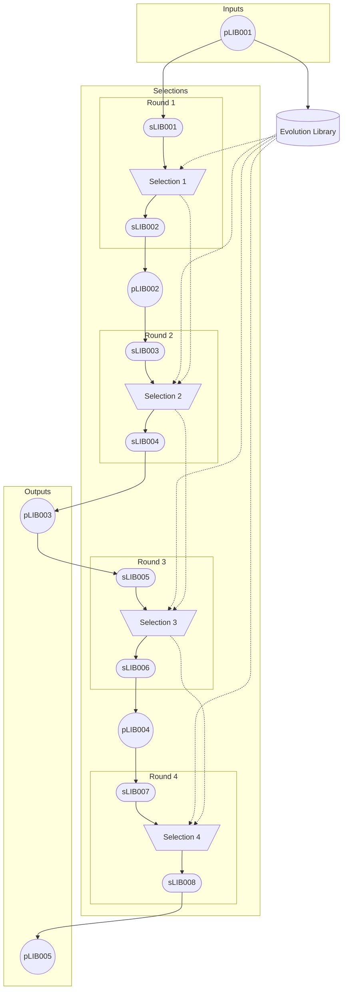

# Example Library/Selection Connectivity

```mermaid
flowchart TB
    pla1 --> lib
    pla1 --> str1 --> sel1
    sel1 --> str2 --> pla2
    pla2 --> str3 --> sel2 --> str4 --> pla3
    pla3 --> str5 --> sel3 --> str6 --> pla4
    pla4 --> str7 --> sel4 --> str8 --> pla5
    
    lib -.-> sel1 & sel2 & sel3 & sel4
    sel1 -.-> sel2 -.-> sel3 -.-> sel4

    lib[("Evolution Library")]
    subgraph Inputs
        pla1((pLIB001))
    end
    subgraph Selections
        subgraph Round 1
            str1([sLIB001])
            sel1[\"Selection 1"/]
            str2([sLIB002])
        end
        pla2((pLIB002))
        subgraph Round 2
            str3([sLIB003])
            sel2[\"Selection 2"/]
            str4([sLIB004])
        end
        subgraph Round 3
            str5([sLIB005])
            sel3[\"Selection 3"/]
            str6([sLIB006])
        end
        pla4((pLIB004))
        subgraph Round 4
            str7([sLIB007])
            sel4[\"Selection 4"/]
            str8([sLIB008])
        end
    end
    subgraph Outputs
        pla3((pLIB003))
        pla5((pLIB005))
    end
```