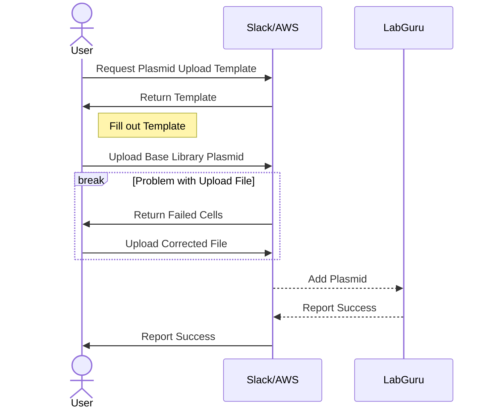
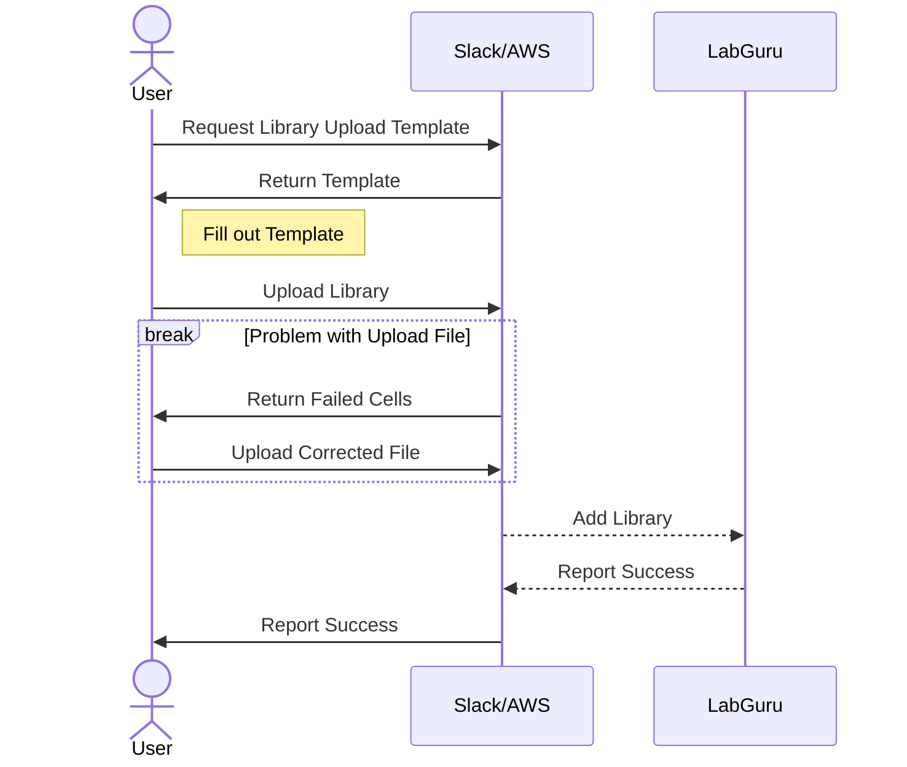
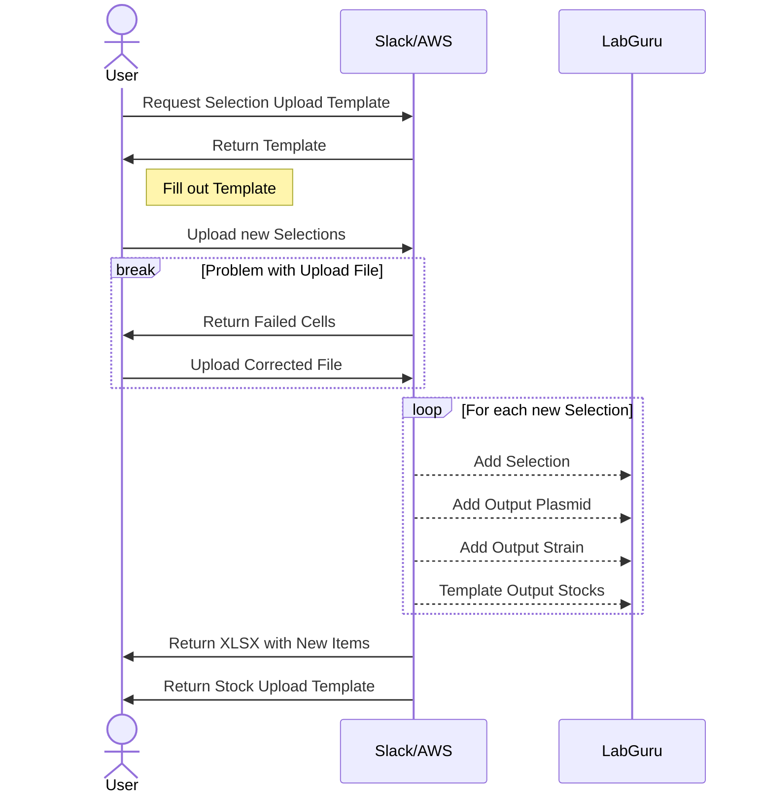

# Selection Upload Process

## Preparing for a new Library
### Step 1 - Add Base Plasmid

```mermaid
sequenceDiagram
    actor User
    participant Slack as Slack/AWS
    participant LabGuru
    User ->> Slack : Request Plasmid Upload Template
    Slack ->> User : Return Template
    Note right of User: Fill out Template
    User ->> Slack : Upload Base Library Plasmid
    break Problem with Upload File
        Slack ->> User : Return Failed Cells
        User ->> Slack : Upload Corrected File
    end
    Slack -->> LabGuru : Add Plasmid
    LabGuru -->> Slack : Report Success
    Slack ->> User : Report Success
```

### Step 2 - Add New Library

```mermaid
sequenceDiagram
    actor User
    participant Slack as Slack/AWS
    participant LabGuru
    User ->> Slack : Request Library Upload Template
    Slack ->> User : Return Template
    Note right of User: Fill out Template
    User ->> Slack : Upload Library 
    break Problem with Upload File
        Slack ->> User : Return Failed Cells
        User ->> Slack : Upload Corrected File
    end
    Slack -->> LabGuru : Add Library
    LabGuru -->> Slack : Report Success
    Slack ->> User : Report Success
```

## Adding a set of selections

```mermaid
sequenceDiagram
    actor User
    participant Slack as Slack/AWS
    participant LabGuru
    User ->> Slack : Request Selection Upload Template
    Slack ->> User : Return Template
    Note right of User: Fill out Template
    User ->> Slack : Upload new Selections
    break Problem with Upload File
        Slack ->> User : Return Failed Cells
        User ->> Slack : Upload Corrected File
    end
    loop For each new Selection
        Slack -->> LabGuru : Add Selection
        Slack -->> LabGuru : Add Output Plasmid
        Slack -->> LabGuru : Add Output Strain
        Slack -->> LabGuru : Template Output Stocks
    end
    Slack ->> User : Return XLSX with New Items
    Slack ->> User : Return Stock Upload Template
```