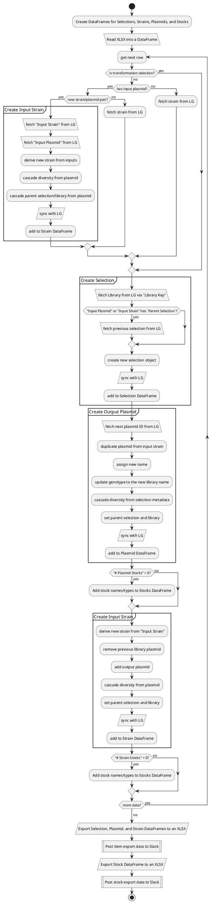

# Selection Upload Logic

```plantuml
@startuml
start
:Create DataFrames for Selections, Strains, Plasmids, and Stocks;
:Read XLSX into a DataFrame; <<load>>
repeat :get next row;
    if (is transformation selection?) then (no)
        if (has input plasmid?) then (yes)
            if (new strain/plasmid pair?) then (yes)
                partition "Create Input Strain" {
                    :fetch "Input Strain" from LG; <<load>>
                    :fetch "Input Plasmid" from LG; <<load>>
                    :derive new strain from inputs;
                    :cascade diversity from plasmid;
                    :cascade parent selection/library from plasmid;
                    :sync with LG; <<save>>
                    :add to Strain DataFrame;
                }
            else (no)
                :fetch strain from LG;
            endif
        else (no)
            :fetch strain from LG;
        endif
    else (yes)
    endif
    partition "Create Selection" {
        :fetch Library from LG via "Library Key"; <<load>>
        if ("Input Plasmid" or "Input Strain" has `Parent Selection`?) then (yes)
            :fetch previous selection from LG; <<load>>
        endif
        :create new selection object;
        :sync with LG; <<save>>
        :add to Selection DataFrame;
    }
    partition "Create Output Plasmid" {
        :fetch next plasmid ID from LG; <<load>>
        :duplicate plasmid from input strain;
        :assign new name;
        :update genotype to the new library name;
        :cascade diversity from selection metadata;
        :set parent selection and library;
        :sync with LG; <<save>>
        :add to Plasmid DataFrame;
    }
    if ("# Plasmid Stocks" > 0?) then (yes)
        :Add stock names/types to Stocks DataFrame;
    else (no)
    endif
    partition "Create Input Strain" {
        :derive new strain from "Input Strain";
        :remove previous library plasmid;
        :add output plasmid;
        :cascade diversity from plasmid;
        :set parent selection and library;
        :sync with LG; <<save>>
        :add to Strain DataFrame;
    }
    if ("# Strain Stocks" > 0?) then (yes)
        :Add stock names/types to Stocks DataFrame;
    else (no)
    endif
repeat while (more data?) is (yes)
->no;
:Export Selection, Plasmid, and Strain DataFrames to an XLSX; <<save>>
:Post item export data to Slack; <<procedure>>
:Export Stock DataFrame to an XLSX; <<save>>
:Post stock export data to Slack; <<procedure>>
stop

@enduml
```